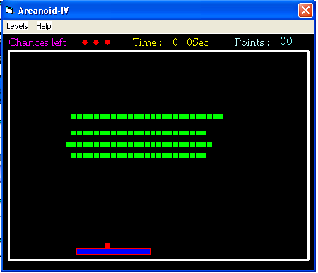



## Arcanoid\-IV

### Description

This code is for the game - ARCANOID
 
### More Info
 
Arrow keys are used to move the rectangular shape1.shape2 is the shape which bounces and which hits the shape3 ( control array)

             |
---                |---
**Submitted On**   |2005-07-17 03:50:02
**By**             |[Prajith\.m\.s](https://github.com/Planet-Source-Code/PSCIndex/blob/master/ByAuthor/prajith-m-s.md)
**Level**          |Beginner
**User Rating**    |5.0 (15 globes from 3 users)
**Compatibility**  |VB 6\.0
**Category**       |[Games](https://github.com/Planet-Source-Code/PSCIndex/blob/master/ByCategory/games__1-38.md)
**World**          |[Visual Basic](https://github.com/Planet-Source-Code/PSCIndex/blob/master/ByWorld/visual-basic.md)
**Archive File**   |[Arcanoid\-I1914187172005\.zip](https://github.com/Planet-Source-Code/prajith-m-s-arcanoid-iv__1-61731/archive/master.zip)

